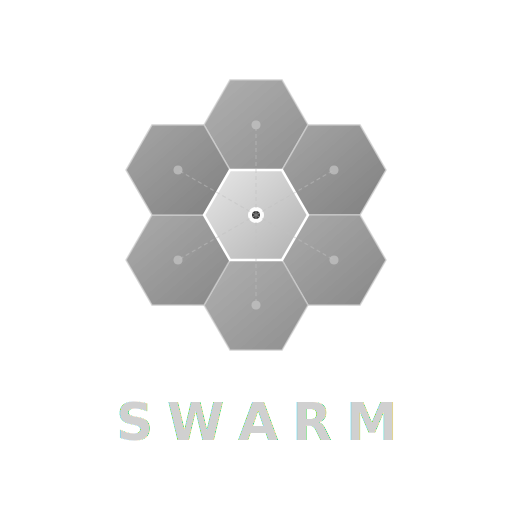

# Swarm

<p align="center">
  
</p>

<p align="center">
  Multi-Agent Collaboration Platform — A Team Lead interface for orchestrating multiple AI agents to accomplish complex tasks together.
</p>

<p align="center">
  <a href="https://swarm.0v0.live">Demo</a> ·
  <a href="LICENSE">License</a> ·
  <a href="https://github.com/MiniMax-AI/skills">Skills</a>
</p>

---

## Overview

Swarm is a real-time multi-agent collaboration platform where you act as a **Team Lead** directing a team of AI agents. Unlike single-agent AI assistants, Swarm enables complex workflows where specialized agents (Researchers, Writers, Analysts, Engineers) work together under your guidance.

## Demo

**Live Demo**: [https://swarm.0v0.live](https://swarm.0v0.live)

> **Note**: You need to bring your own LLM API key. Configure it in **Settings → API Configuration** after logging in.

## Key Concepts

| Role | Description |
|------|-------------|
| **Team Lead (You)** | Human operator who directs, approves, and coordinates the team |
| **Lead Agent** | Your AI assistant that breaks down tasks and assigns work |
| **Worker Agents** | Specialized agents (Researcher, Writer, Analyst, Engineer, etc.) |

## Architecture

```
User (Team Lead)
    │
    ├── Lead Agent (AI Assistant)
    │       │
    │       ├── Researcher Agent
    │       ├── Writer Agent
    │       ├── Analyst Agent
    │       └── Engineer Agent
    │
    └── Real-time WebSocket Communication
```

## Features

### Multi-Agent Task Management
- Create, assign, and track tasks across agent team
- Task dependencies and priority system (LOW/MEDIUM/HIGH/CRITICAL)
- Subtask decomposition for complex goals
- Task status: PENDING → ASSIGNED → IN_PROGRESS → COMPLETED/FAILED/CANCELLED

### Real-Time Collaboration
- WebSocket-based agent-to-agent messaging
- Internal threads for agent coordination
- Live task status updates with visual monitoring dashboard
- Session pause/resume control

### Skills System
Extensible skill registry for specialized agent capabilities:

| Skill | Purpose |
|-------|---------|
| `docx-dev` | Professional DOCX document creation/editing with XSD validation |
| `xlsx-dev` | Excel operations — read, create, edit via XML, formula validation |
| `shader-dev` | GLSL shader techniques — 36 techniques (ray marching, SDF, PBR, etc.) |
| `fullstack-dev` | Full-stack architecture — feature-first structure, auth, caching |
| `pdf-dev` | PDF generation — 15 document types, token-based design system |
| `pptx-generator` | PowerPoint creation — cover/TOC/section/content/summary slides |
| `webapp-building` | React + TypeScript + Vite + Tailwind + shadcn/ui scaffolding |
| `grok-search` | Real-time web search via Grok API |
| `code-review` | Code quality review — bugs, security, performance, style |
| `structured-report` | Report organization in Markdown/JSON formats |

### Cognitive Architecture
- **Cognitive Inbox** — Lead agent with attention loop for message prioritization
- **Context Compaction** — Automatic summarization of old conversation history
- **Teammate Rate Limiting** — Max 5 messages to same teammate per 60 seconds
- **Ceremonial Message Detection** — Skips redundant completion messages

### Session Workspace
- Per-session isolated workspace directories
- Python virtual environment management with base venv (COW copying)
- File MIME type inference (100+ file types supported)
- Path security (no traversal attacks)

### Tool Approval System
Dangerous operations require explicit approval:
- Shell command execution
- File system writes
- Network requests
- Configurable approval rules per session

### Session Management
- Create and archive collaboration sessions
- Share session snapshots with others via token
- Token usage tracking per session
- Auto session renaming based on content

### File Handling
- Upload and preview documents (Excel, Word, PDF, PowerPoint)
- File sharing between user and agents
- Thumbnail generation for images
- Text extraction from various file types
- Supported: .docx, .xlsx, .pptx, .pdf, images, code files, configs, archives

### Command Palette
- Keyboard-driven command interface for power users

### Monitoring Dashboard
- Real-time agent status monitoring
- Task flow visualization with dependency chart
- Agent activity tracking

## Tech Stack

| Layer | Technology |
|-------|------------|
| Frontend | Next.js 16, React 19, TypeScript, Tailwind CSS, Radix UI, Framer Motion, Zustand |
| Backend | Node.js, WebSocket (ws), Prisma ORM |
| Database | SQLite (libSQL) |
| AI | Anthropic Claude API |
| File Processing | Python 3.9+, python-docx, openpyxl, reportlab, PptxGenJS, markitdown |

## Getting Started

### Prerequisites

- Node.js 18+
- Python 3.9+ (for file processing skills)
- npm / yarn / pnpm / bun

### Installation

```bash
# Install dependencies
npm install

# Configure environment
cp .env.local.example .env.local
# Edit .env.local with your API keys

# Start development server
npm run dev
```

Open [http://localhost:3000](http://localhost:3000) in your browser.

### Environment Variables

```env
# Database
DATABASE_URL="file:./dev.db"

# Authentication
JWT_SECRET="your-super-secret-jwt-key-change-this-in-production"
JWT_REFRESH_SECRET="your-super-secret-refresh-key-change-this-in-production"

# App Configuration
NEXT_PUBLIC_APP_NAME=Swarm
NEXT_PUBLIC_APP_VERSION=1.0.0
NEXT_PUBLIC_API_URL=/api

# File Upload
UPLOAD_DIR="./uploads"
MAX_UPLOAD_SIZE=104857600

# LLM API keys are configured per-user in the web UI (Settings → API Configuration)
```

## Project Structure

```
src/
├── app/                    # Next.js App Router pages
│   ├── (dashboard)/        # Main application pages
│   │   ├── agents/        # Agent management
│   │   ├── chat/          # Chat interface
│   │   ├── dashboard/     # Dashboard & analytics
│   │   ├── files/         # File browser
│   │   ├── help/          # Help page
│   │   ├── profile/       # User profile
│   │   └── settings/      # User settings
│   ├── api/               # REST API routes
│   ├── login/             # Authentication
│   └── register/          # User registration
├── components/
│   ├── chat/              # Chat UI components
│   ├── layout/            # Layout components
│   ├── monitor/           # Agent monitoring dashboard
│   ├── providers/         # React providers
│   ├── session/           # Session management UI
│   ├── settings/          # Settings UI
│   ├── tool-approval/     # Tool approval UI
│   ├── ui/                # Shadcn/ui components
│   └── websocket/         # WebSocket components
├── hooks/                  # React custom hooks (15+ hooks)
├── lib/
│   ├── api/               # API client functions
│   ├── auth/              # Authentication helpers
│   ├── server/            # Server-side logic
│   │   ├── cognitive-inbox/   # Cognitive architecture
│   │   ├── llm/           # LLM integration
│   │   ├── skills/        # Skills system
│   │   └── tools/         # Agent tools
│   └── utils/             # Utilities
├── stores/                 # Zustand state stores
│   ├── authStore          # Authentication state
│   ├── sessionsStore      # Swarm sessions
│   ├── llmConfigsStore    # LLM API configs
│   ├── themeStore         # Theme preferences
│   ├── uiStore            # UI state
│   └── leadPreferencesStore
└── types/                  # TypeScript type definitions

server.mjs                  # Custom Node.js server (HTTP + WebSocket)
prisma/
└── schema.prisma          # Database schema (20+ models)
skills/
├── _registry/             # Built-in skills (MIT License)
└── users/                 # User-installed skills
```

## API Reference

### Core Endpoints

| Endpoint | Description |
|----------|-------------|
| `POST /api/auth/login` | User login |
| `POST /api/auth/register` | User registration |
| `GET /api/sessions` | List swarm sessions |
| `POST /api/swarm-sessions` | Create swarm session |
| `GET /api/swarm-sessions/:id` | Get session details |
| `POST /api/swarm-sessions/:id/pause` | Pause session |
| `POST /api/swarm-sessions/:id/resume` | Resume session |
| `GET /api/swarm-sessions/:id/monitor` | Monitor session |
| `POST /api/tasks` | Create task |
| `GET /api/tasks/:id/dependencies` | Get task dependencies |
| `POST /api/tasks/:id/status` | Update task status |
| `GET /api/files` | List files |
| `POST /api/files` | Upload file |
| `POST /api/files/extract-text` | Extract text from file |
| `GET /api/agents/:id` | Get agent |
| `POST /api/agents/:id/terminate` | Terminate agent |
| `POST /api/tool-approvals/:id/action` | Approve/reject tool |
| `GET /api/skills` | List available skills |
| `POST /api/ws` | WebSocket upgrade |

## Development

```bash
# Start development server
npm run dev

# Lint code
npm run lint

# Database migration
npm run db:migrate

# Build for production
npm run build

# Start production server
npm start
```

## Documentation

For detailed development guidelines, see:

- [Frontend Guidelines](./.trellis/spec/frontend/index.md)
- [Backend Guidelines](./.trellis/spec/backend/index.md)
- [Thinking Guides](./.trellis/spec/guides/index.md)

## License

This project is licensed under the **MIT License** - see [LICENSE](LICENSE) for details.

This project includes skills from [MiniMax-AI/skills](https://github.com/MiniMax-AI/skills) (MIT License). See [CREDITS.md](CREDITS.md) for details.
